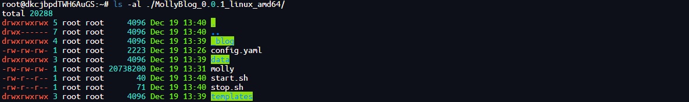
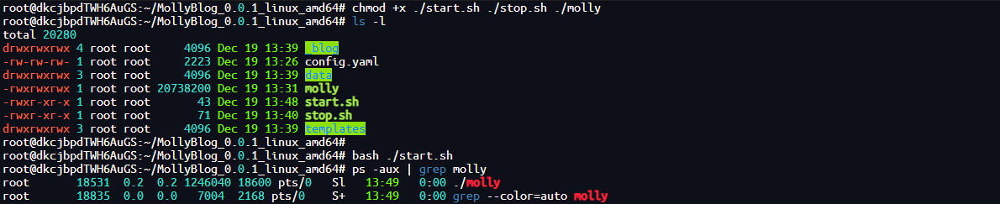
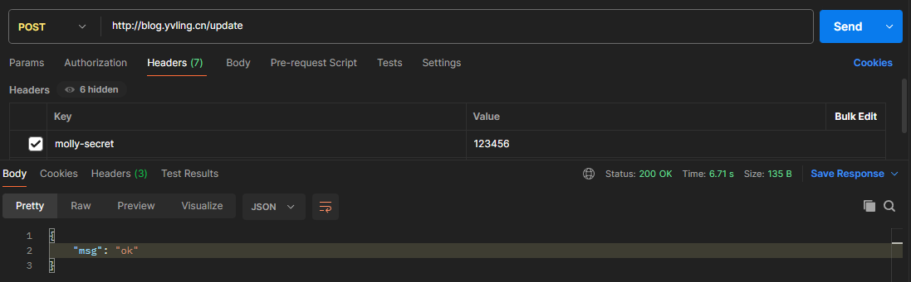
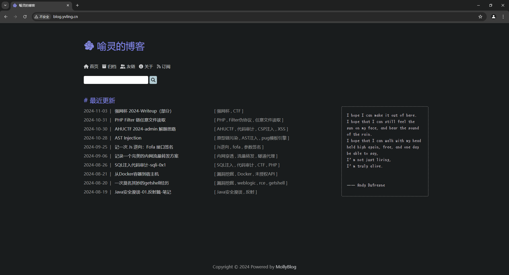
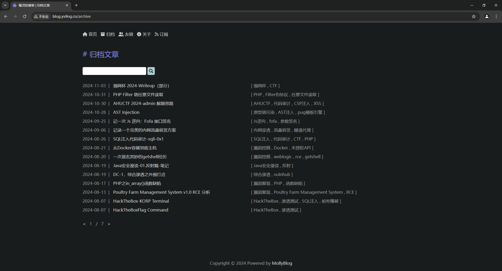
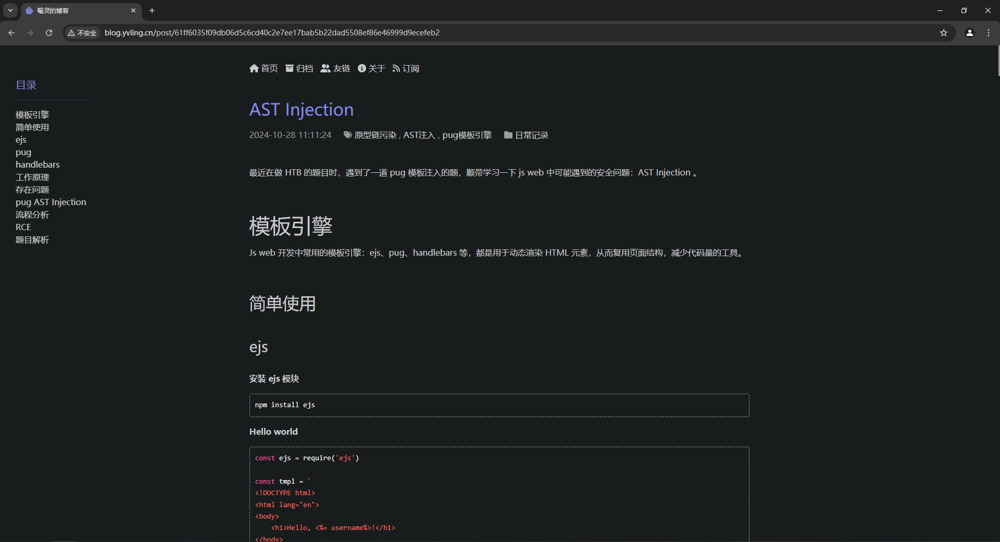
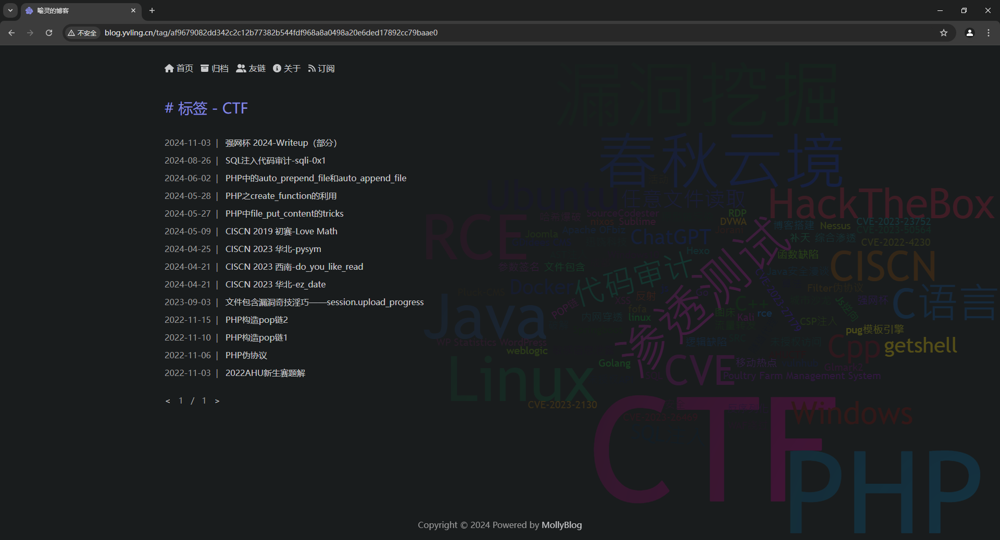

<div align="center">
    </br>
    <h1>Molly Blog</h1>
    <p>A simple and easy-to-use blog</p>
</div>

----

# What's this?

This is a simple and easy-to-use personal blog system that I developed for my own use. 
It is based on the Gin framework and uses object storage services as a carrier. 

I usually use Obsidian to write blogs, then synchronize the Markdown files to Tencent Cloud Object Storage (COS), 
and then send an update request to MollyBlog, which will automatically pull the latest files from COS and render them into HTML. 

I will continue to add features I like in the future. If you have good ideas, welcome to raise issues!


# How to start?

You only need to download the latest file that matches your system architecture from the release, 
and unzip it as shown below:




In the `_blog/src/about` , put your self-introduction file, which is named `index.md` by default.
Of course, you can also configure it in `config.yaml`

Edit `config.yaml`, including website information, object storage configuration, friend link configuration, etc.

Then run the program using the following command:

```shell
chmod +x ./start.sh ./stop.sh ./molly
bash ./start.sh
```




If you want to update your blog, 
please synchronize your blog to COS and use the following command to send an update request to Molly:

```shell
curl --location --request POST 'http://[HOST]:[PORT]/update' \
--header 'molly-secret: [SECRET_KEY]'
```



If you modify the configuration file, please run `stop.sh` to stop the program, 
and then re-run `start.sh` to start the program.

```shell
bash ./stop.sh
bash ./start.sh
```


# My Blog









